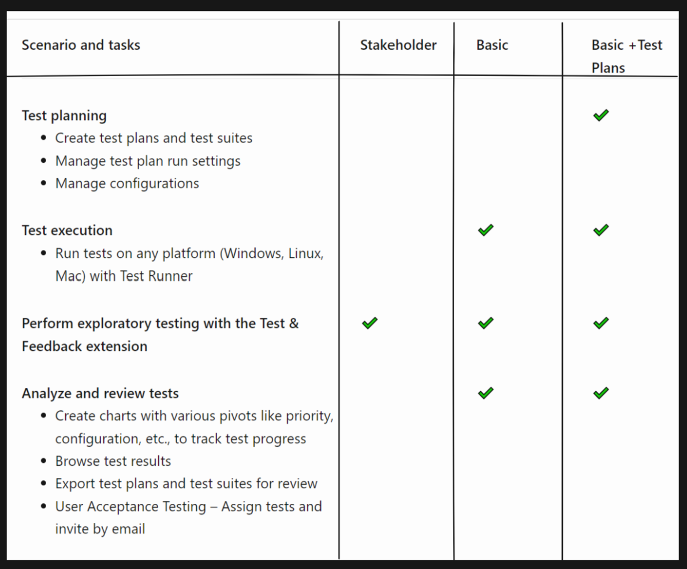
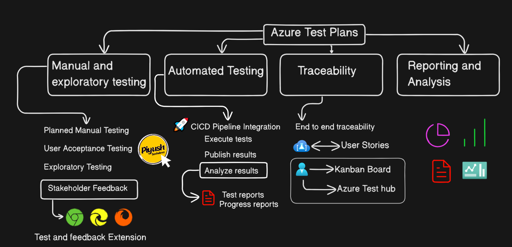

# 🧪 Testing in Azure DevOps – Manual, Exploratory, and Automated

## 🔗 Overview of End-to-End Pipeline

```
Developer Commits Code → Azure Repos (Git) → Build Pipeline (CI) → Release Pipeline (CD) → Deploy to Azure App Service → Test in Azure Test Plans
```

In previous days, we focused on **code management (Azure Repos)**, **project planning (Azure Boards)**, and **automated deployment (Azure Pipelines + Azure App Service)**.  
Today, we focus on the **testing phase** using **Azure Test Plans** — part of Azure DevOps.

---

## 📋 What is Azure Test Plans?

**Azure Test Plans** is a test management tool integrated into Azure DevOps that enables teams to plan, execute, and track both **manual** and **exploratory testing**.

It helps ensure software quality before release by validating features against requirements.

---

## ✍️ Types of Testing in Azure Test Plans

### 1. **Planned Manual Testing**
This involves structured testing based on predefined test cases and plans.

#### Who does it?
- Designated testers
- Test leads

#### Components:
- **Test Plans**: Collection of test suites and test cases.
- **Test Suites**: Group test cases into logical scenarios or modules.
- **Test Cases**: Step-by-step instructions to validate a specific feature.
- **Shared Steps**: Reusable steps across multiple test cases.

#### Example:
> Test Case: "Verify Login Functionality"
> - Step 1: Navigate to login page
> - Step 2: Enter valid username and password
> - Step 3: Click “Login”
> - Expected Result: User is redirected to dashboard

---

### 2. **User Acceptance Testing (UAT)**
Conducted by end-users or stakeholders to verify that the system meets business needs.

#### Key Points:
- Ensures software aligns with user expectations
- Often includes real-world use cases
- Can be tracked via Azure Dashboards

---

### 3. **Exploratory Testing**
Unscripted testing where testers explore the application freely to find defects or usability issues.

#### Who does it?
- Developers
- Testers
- UX/UI designers

#### Tools:
- **Azure Test & Feedback Browser Extension**
  - Allows users to record screen videos
  - Capture feedback directly from the browser
  - Submit bugs with screenshots and logs

---

### 4. **Stakeholder Feedback**
External stakeholders (e.g., marketing, sales, customers) can provide feedback using the **Azure Test & Feedback extension** without needing deep technical knowledge.

#### Access Requirements:
- Stakeholders need **Stakeholder access level** in Azure DevOps

---

## 🤖 Automated Testing Integration with Azure Pipelines

Azure Test Plans integrates with **Azure Pipelines** to support automated testing as part of CI/CD.

### How It Works:
1. After deployment, automated tests are triggered in the pipeline
2. Results are published back to Azure Test Plans
3. Teams can view pass/fail status directly in dashboards

### Benefits:
- Early bug detection
- Faster feedback loop
- Traceability between code changes and test results

---

## 🔗 Traceability Between Tests and Requirements

Azure Test Plans allows linking **test cases** and **test suites** to:

- **User Stories**
- **Features**
- **Epics**

This ensures **end-to-end traceability** from requirement to implementation to validation.

### Why It Matters:
- Helps assess the **quality of each requirement**
- Makes it easy to see what’s been tested and what hasn’t
- Supports compliance and audit readiness

---

## 📊 Reporting and Analysis

Azure Test Plans offers robust reporting capabilities:

### Built-in Reports:
- **Progress Report**: Shows how many tests passed vs failed
- **Pipeline Test Results Report**: Links test runs to builds/deployments
- **Analytics Services**: Provides trend analysis over time

### Dashboard Widgets:
- Charts showing:
  - Test case completion
  - Test result trends
  - Defect tracking

---

## 🛠️ Roles and Access Levels



| Role | Required Access Level |
|------|------------------------|
| Execute/Create/Publish Test Cases | **Basic + Test Plan Access**
| Run Test Runner | At least **Basic Access**
| Perform Exploratory Testing with Feedback Extension | **Stakeholder Access**

> Note: You can manage these roles under **Organization Settings > Users** in Azure DevOps.

---

## 📦 Core Concepts in Azure Test Plans

| Concept | Description |
|--------|-------------|
| **Test Plan** | A container for organizing test suites and test cases |
| **Test Suite** | Groups test cases into related scenarios (e.g., Login Module, Cart Functionality) |
| **Test Case** | A set of steps to validate an application feature |
| **Shared Steps** | Reusable steps used across multiple test cases |
| **Test Configuration** | Defines different environments or data sets for testing (e.g., Chrome on Windows, Safari on iOS) |

---

## 👥 Stakeholders Involved in Testing

| Role | Responsibility |
|------|----------------|
| **Test Lead** | Oversees manual testing efforts, creates test plans |
| **Tester** | Executes test cases, reports bugs |
| **Product Owner / Stakeholder** | Performs UAT, validates against business needs |
| **UX Designer** | Conducts exploratory testing for usability |
| **DevOps Engineer** | Integrates testing into pipelines |
| **Developer** | Fixes bugs reported during testing |
| **Customer / End User** | Validates the product in real-world conditions |

---

## 🎯 Summary Diagram: Azure Test Plans Workflow



```
+----------------------------+
| Developer Commits Code     |
+------------+---------------+
             |
             v
+----------------------------+
| Azure Repos (Git)          |
+------------+---------------+
             |
             v
+----------------------------+
| Azure Build Pipeline (CI)  |
+------------+---------------+
             |
             v
+----------------------------+
| Azure Release Pipeline (CD)|
+------------+---------------+
             |
             v
+----------------------------+
| Azure Test Plans           |
| - Manual Testing           |
| - Exploratory Testing      |
| - UAT                      |
| - Automated Testing        |
| - Bug Reporting            |
| - Traceability & Reporting |
+----------------------------+
```

---

## ✅ Final Notes

- **Azure Test Plans** supports both **manual** and **automated testing**.
- It integrates seamlessly with **Azure Pipelines** and **Azure Boards**.
- Use **traceability** to link test cases to work items like user stories and features.
- Enable **stakeholder involvement** through the **Test & Feedback extension**.
- Use **dashboards and reports** to monitor test progress and quality trends.

---
